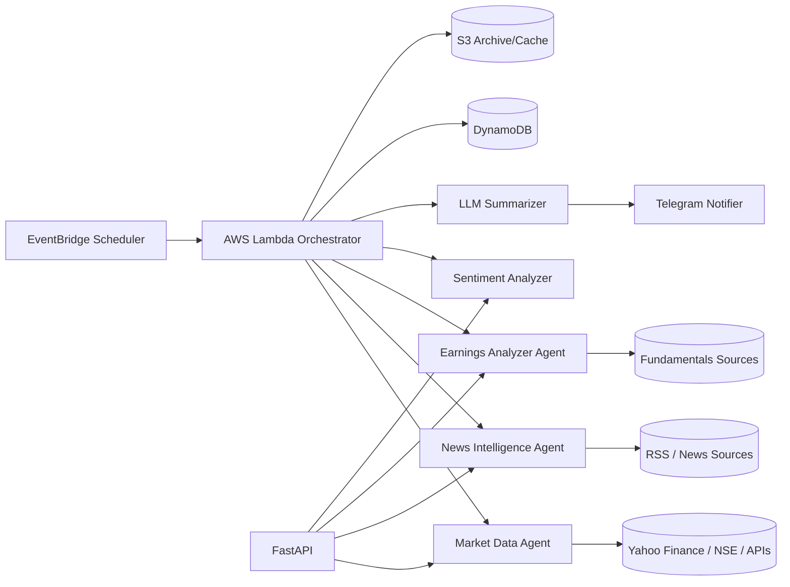

# AI Stock Market Intelligence Agent

Production-ready, modular AI agent for Indian stock market intelligence.  
It collects market and news signals, analyzes sentiment and earnings snapshots, generates institutional-style summaries with LLMs, and auto-delivers reports to Telegram on schedule.

## Core Capabilities
- Tracks Nifty 50, Sensex, Bank Nifty, Midcap and VIX snapshots
- Computes top gainers/losers, gap moves, and volume spikes
- Fetches and ranks market news by importance and sentiment
- Generates quarterly highlights from fundamentals snapshots
- Produces concise AI-generated report text
- Sends scheduled reports via Telegram at 8 AM, 1 PM, 4 PM, and 8 PM IST
- Exposes FastAPI endpoints for dashboard/API consumption

## Architecture



## Project Structure

- `src/collectors`: external data retrieval
- `src/parsers`: deterministic parsing + classification
- `src/agents`: domain-specific intelligence agents
- `src/summarizers`: prompt engineering + LLM abstraction + report synthesis
- `src/notifiers`: Telegram delivery
- `src/database`: DynamoDB/S3 persistence
- `src/scheduler`: orchestration + Lambda handlers
- `src/api`: FastAPI routes
- `src/utils`: config, logging, retry, cache

## API Endpoints
- `GET /market-summary`
- `GET /top-gainers`
- `GET /top-losers`
- `GET /company-news/{ticker}`
- `GET /earnings-summary/{ticker}`
- `GET /market-sentiment`

## Local Run
```bash
python -m venv .venv
.venv\Scripts\activate
pip install -r requirements.txt
copy .env.example .env
uvicorn src.api.main:app --reload
```

## Lambda + EventBridge Scheduling
Schedules are configured in `serverless.yml`:
- Pre-market: `08:00 IST`
- Midday: `13:00 IST`
- Closing: `16:00 IST`
- Deep analysis: `20:00 IST`

Deploy:
```bash
npm i -g serverless
serverless deploy
```

## Docker
Build:
```bash
docker build -t stock-intel-agent .
```

Run containerized Lambda runtime:
```bash
docker run --env-file .env -p 9000:8080 stock-intel-agent
```

## Prompt Engineering Strategy
- **Market summary prompt**: enforces concise institutional brief and risk section
- **Sentiment QA prompt**: controlled analyst Q&A for explainability
- Structured JSON context reduces hallucination and keeps output deterministic

## Error Handling and Reliability
- Exponential retry on external APIs via `tenacity`
- LLM fallback summarizer when provider fails
- Deduped news ingestion and defensive parsing
- Structured logs for CloudWatch observability

## Cost Optimization
- Keep Lambda memory and timeout bounded
- Use report-type specific invocations instead of heavy all-day polling
- Cache repeated reads in-memory/S3
- Store only compact historical payloads in DynamoDB with TTL

## Security
- Environment-based config for local use
- Production secrets in AWS Secrets Manager
- Least-privilege IAM for Lambda -> DynamoDB/S3/CloudWatch

## Future Enhancements
- Personalized watchlists and portfolio alerts
- Technical indicators engine (RSI/MACD/ATR)
- RAG research assistant over annual reports/transcripts
- WhatsApp integration and web dashboard
- Mobile app with push notifications
- AI-generated chart cards for Telegram delivery
